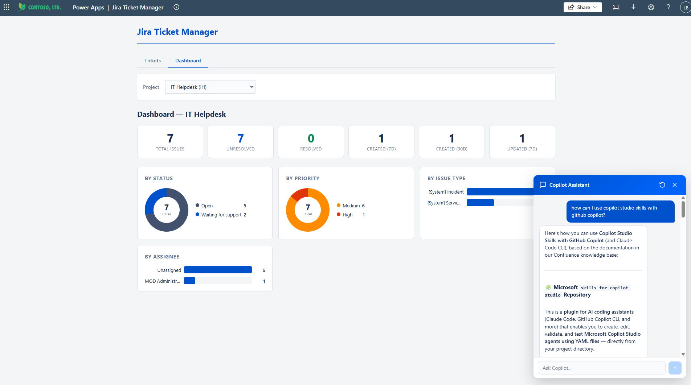
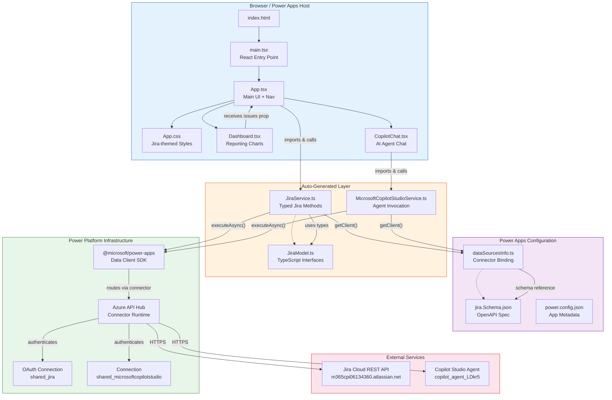
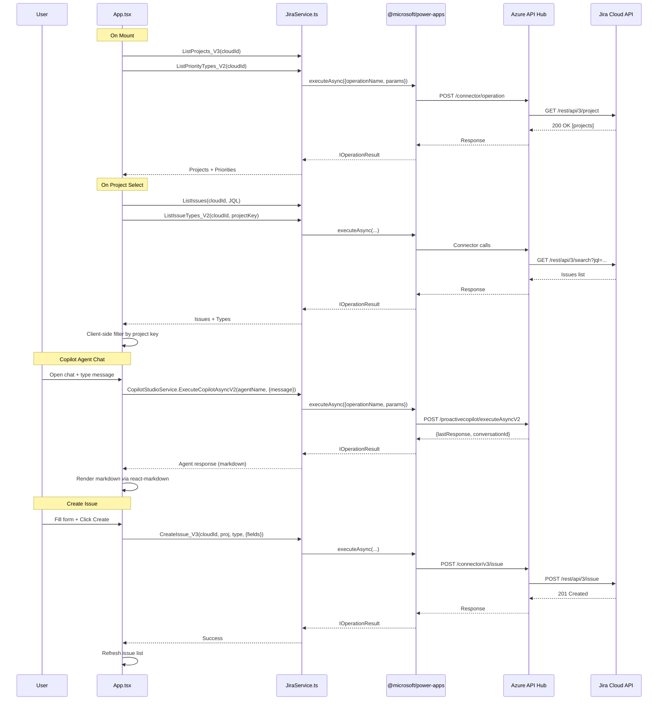

# Jira Ticket Manager — Power Apps Code App

> **[📖 Architecture](#architecture-diagram)** | **[🚀 Vibe Coding Guide](VIBE_CODING_GUIDE.md)**



## What is this?

A **vibe-coded** Power Apps Code App that brings together **Jira**, **Confluence**, and **Microsoft Copilot Studio** into a single, modern interface — built entirely with AI-assisted development using GitHub Copilot.

### Features

- **Jira Ticket CRUD** — Create, read, update, and comment on Jira issues directly from Power Apps
- **Reporting Dashboard** — Visual analytics with KPI cards, donut charts (by status & priority), and bar charts (by issue type & assignee) — all computed client-side from live Jira data
- **Embedded Copilot Studio Agent** — A floating AI chat widget connected to a Copilot Studio agent that uses the **Atlassian Rovo MCP tool** to reason over Confluence pages and Jira tickets, delivering contextual answers with rich markdown formatting
- **Power Platform Native** — No direct API calls; everything flows through Power Platform connectors (`shared_jira` + `shared_microsoftcopilotstudio`) with automatic OAuth handling

### How the Copilot Agent Works

The embedded Copilot Studio agent isn't just a chatbot — it's connected to **Atlassian Rovo via MCP (Model Context Protocol)**, giving it the ability to:

- **Search and reason over Confluence knowledge base pages** — documentation, runbooks, SOPs
- **Query Jira tickets** — look up issue details, statuses, assignees, and history
- **Provide contextual answers** — combining information from both Confluence and Jira to answer questions like *"how can I use Copilot Studio skills with GitHub Copilot?"* with grounded, sourced responses

The agent runs in Copilot Studio with Microsoft authentication, invoked via the `ExecuteCopilotAsyncV2` connector action — no MSAL tokens, no redirect URIs, no popup auth required.

### Tech Stack

| Layer | Technology |
|---|---|
| **Frontend** | React 19 + TypeScript 5.9 + Vite 7 |
| **Platform** | Power Apps Code Apps |
| **Data** | Power Platform Jira Connector (OAuth) |
| **AI Agent** | Copilot Studio + Atlassian Rovo MCP Tool |
| **Rendering** | react-markdown for agent responses |
| **Deployment** | `pac code push` via PAC CLI |

---

## Overview

The Jira Ticket Manager is a **Power Apps Code App** built with **React + TypeScript + Vite**. It provides full CRUD operations on Jira Cloud issues, an **interactive reporting dashboard**, and an embedded **Copilot Studio AI agent** for natural-language ticket assistance — all powered by **Power Platform connectors** (Jira + Microsoft Copilot Studio). API traffic is routed through Azure API Hub, which handles OAuth authentication and request proxying.

---

## Architecture Diagram



### Request Flow Summary

```
App.tsx → JiraService.ts → @microsoft/power-apps SDK → Azure API Hub → Jira Cloud REST API
CopilotChat.tsx → MicrosoftCopilotStudioService.ts → @microsoft/power-apps SDK → Azure API Hub → Copilot Studio Agent
```

All API calls go through the Power Platform connector infrastructure. The app never talks to Jira or Copilot Studio directly — Azure API Hub handles authentication, rate limiting, and request routing.

---

## Execution Flow (Sequence)



---

## Project Structure

```
jira-confluence-vibe-coded-app/
├── .power/                          # Power Apps connector configuration
│   └── schemas/
│       ├── appschemas/
│       │   └── dataSourcesInfo.ts   # Binds connectors + connection IDs to data sources
│       ├── jira/
│       │   └── jira.Schema.json     # OpenAPI schema for Jira connector
│       └── microsoftcopilotstudio/
│           └── microsoftcopilotstudio.Schema.json  # OpenAPI schema for Copilot Studio connector
├── src/
│   ├── main.tsx                     # React entry point (renders <App />)
│   ├── App.tsx                      # Main UI — nav tabs, CRUD views, orchestration
│   ├── App.css                      # All styles (layout, modals, dashboard, chat widget)
│   ├── index.css                    # Base/reset styles
│   ├── Dashboard.tsx                # Reporting dashboard — KPIs, donut & bar charts
│   ├── CopilotChat.tsx              # Embedded Copilot Studio agent chat widget
│   └── generated/                   # Auto-generated from connector schemas (DO NOT EDIT)
│       ├── index.ts                 # Barrel export for models + services
│       ├── models/
│       │   ├── JiraModel.ts         # TypeScript interfaces (FullIssue, Comment, etc.)
│       │   └── MicrosoftCopilotStudioModel.ts  # Copilot response types
│       └── services/
│           ├── JiraService.ts       # Typed service methods for Jira operations
│           └── MicrosoftCopilotStudioService.ts  # Typed methods for Copilot agent invocation
├── power.config.json                # App ID, environment, connection references (Jira + Copilot Studio)
├── vite.config.ts                   # Vite + Power Apps plugin config
├── package.json                     # Dependencies: react, @microsoft/power-apps, react-markdown
└── tsconfig.json                    # TypeScript configuration
```

---

## Key Files Explained

### `power.config.json` — App Identity & Connections

Defines the Power Apps app ID, target environment, and connection references:

| Field | Purpose |
|---|---|
| `appId` | Power Apps app GUID |
| `environmentId` | Target Power Platform environment |
| `connectionReferences` | Maps `shared_jira` → `jira` data source and `shared_microsoftcopilotstudio` → `microsoftcopilotstudio` data source |
| `buildPath` / `buildEntryPoint` | Tells Power Apps where the built SPA lives |

### `.power/schemas/appschemas/dataSourcesInfo.ts` — Connector Binding

Auto-generated file that maps the `jira` data source name to:
- The connector's API operations (paths, methods, parameters)
- The connection ID for authentication
- Parameter schemas for each operation

This is consumed by `getClient(dataSourcesInfo)` in JiraService.ts to create the data client.

### `.power/schemas/jira/jira.Schema.json` — OpenAPI Specification

The complete OpenAPI/Swagger schema for the Power Platform Jira connector. Contains every operation (50+), parameter definitions, response schemas, and dynamic value configurations. This is the source of truth that drives code generation.

### `src/generated/services/JiraService.ts` — API Service Layer

**Auto-generated — do not edit directly.** Provides typed static methods for each Jira connector operation:

```typescript
// Pattern for every method:
public static async OperationName(params...): Promise<IOperationResult<ResponseType>> {
    return JiraService.client.executeAsync({
        connectorOperation: {
            tableName: 'jira',
            operationName: 'OperationName',
            parameters: { ...params }
        }
    });
}
```

Key methods used by the app:

| Method | Purpose | Version Note |
|---|---|---|
| `ListProjects_V3(cloudId)` | Get all projects | V3 required for OAuth |
| `ListIssues(cloudId, jql)` | Query issues via JQL | V1 but works with cloud ID |
| `GetIssue_V2(cloudId, key)` | Fetch single issue detail | V2 required |
| `CreateIssue_V3(cloudId, proj, type, item)` | Create new issue | V3 with `{fields:{...}}` body |
| `UpdateIssue_V2(cloudId, key, body)` | Edit issue fields | V2 with `{fields:{...}}` body |
| `AddComment_V2(cloudId, key, body)` | Add comment to issue | V2 with `{body: text}` |
| `ListIssueTypes_V2(cloudId, proj)` | Get issue types for project | V2 required |
| `ListPriorityTypes_V2(cloudId)` | Get priority options | V2 required |

### `src/generated/models/JiraModel.ts` — Type Definitions

TypeScript interfaces for all request/response types: `FullIssue`, `CreateIssueRequest`, `UpdateIssueRequest`, `Comment`, `ProjectArrayItem`, `IssueTypesItem`, `PriorityListItem`, etc.

### `src/App.tsx` — Application Component

Main React component that orchestrates navigation, CRUD views, and child components:

| Section | Purpose |
|---|---|
| Imports + Constants | Cloud ID, helper functions, component imports |
| State declarations | React state for projects, issues, forms, UI flags, active tab |
| `useEffect` (mount) | Loads projects + priorities on startup |
| `loadIssues()` | Fetches + filters issues by selected project |
| `handleCreate/Edit/AddComment` | CRUD operations with `{fields:{...}}` wrappers |
| Nav tabs | "Tickets" and "Dashboard" tab switcher |
| JSX: List view | Project selector, issue table |
| JSX: Detail view | Issue detail + comments panel |
| JSX: Dashboard | `<Dashboard issues={issues} projectName={...} />` |
| JSX: Modals | Create/Edit issue forms |
| JSX: Chat | `<CopilotChat />` floating widget |

### `src/Dashboard.tsx` — Reporting Dashboard

Pure component that visualizes issue data passed via props. No API calls — it computes all metrics from the `issues` array.

| Section | Purpose |
|---|---|
| KPI cards | Total Issues, Unresolved, Resolved, Created (7d/30d), Updated (7d) |
| Donut charts | Issues by Status (Jira color-coded), Issues by Priority |
| Bar charts | Issues by Issue Type, Issues by Assignee |
| `countBy()` helper | Groups issues by any field for chart data |
| `DonutChart` | CSS conic-gradient donut with legend |
| `BarChart` | Horizontal bar chart with labels and counts |

### `src/CopilotChat.tsx` — Copilot Studio Agent Chat

Floating chat widget that communicates with a Copilot Studio agent via the `shared_microsoftcopilotstudio` connector.

| Section | Purpose |
|---|---|
| `AGENT_NAME` | Schema name of the published Copilot Studio agent (`copilot_agent_LDkr5`) |
| `sendMessage()` | Calls `ExecuteCopilotAsyncV2` with message, tracks `conversationId` for multi-turn |
| Response handling | Extracts `lastResponse` or `responses[]` with flexible casing |
| Markdown rendering | Bot messages rendered via `react-markdown` (headings, bold, lists, blockquotes, code) |
| UI | Floating action button → popup with message bubbles, typing indicator, input bar |

The connector handles all authentication — no MSAL, no tokens, no redirect URIs needed.

### `src/App.css` — Styling

Jira-inspired design system with styles for:
- Layout (`.app`, `.app-header`, `.project-bar`, `.app-nav`)
- Data display (`.issue-table`, `.status-badge`, `.priority-icon`)
- Modals (`.modal-overlay`, `.modal`, `.modal-header/body/footer`)
- Forms (`.form-group`, inputs, selects, textareas)
- Detail view (`.detail-panel`, `.detail-meta`, `.comments-section`)
- Dashboard (`.dash-kpis`, `.dash-card`, `.dash-donut`, `.dash-bar-chart`)
- Copilot chat (`.copilot-fab`, `.copilot-popup`, `.copilot-msg-bubble`, `.copilot-bubble-bot` markdown styles)
- Feedback (`.error-banner`, `.loading`, `.empty-state`)

---

## Critical Implementation Details

### Jira Cloud ID (not URL)

All V2/V3 connector methods require a **Jira Cloud ID** (UUID), not the instance URL. This is obtained at app startup via `ListResources()`:

```
Cloud ID: 27530a7f-61f9-4188-b04e-1db1f9d8cdb0
Instance: m365cpi06134360.atlassian.net
```

Currently hardcoded in `App.tsx` as `JIRA_CLOUD_ID`. For multi-tenant scenarios, call `ListResources()` dynamically.

### API Version Requirements

The Power Platform Jira connector has multiple versions of each operation. With OAuth connections:

| Version | Behavior |
|---|---|
| V1 (no suffix) | Returns **406** for most operations. Exception: `ListIssues` works. |
| V2 / V3 | Required for OAuth connections. Need cloud ID as `X-Request-Jirainstance` header. |

### Request Body Structure

Write operations require a `{ fields: { ... } }` wrapper matching the Jira REST API:

```typescript
// Create issue
{ fields: { summary: "...", description: "...", priority: { id: "..." } } }

// Update issue  
{ fields: { summary: "...", description: "..." } }

// Add comment (no fields wrapper)
{ body: "Comment text" }
```

### Client-Side Project Filtering

The `ListIssues` connector operation may return issues from all projects despite JQL filtering. The app applies a client-side filter matching issue keys against the selected project key prefix (e.g., `DEMO-*`).

### API Response Quirks

| Issue | Workaround |
|---|---|
| `ListProjects_V3` returns `value` (singular) | Check both `rawProj['value']` and `rawProj['values']` |
| Descriptions may be ADF (Atlassian Document Format) | `extractText()` helper handles both string and ADF |
| Comments nested under `fields.comment.comments` | `getComments()` helper traverses the structure |
| New issues not immediately queryable | 1.5s delay before refreshing after create |

---

## Developer Commands

```bash
# Local development
npm run dev              # Start Vite dev server (http://localhost:3000)

# Build & deploy
npm run build            # TypeScript compile + Vite production build
pac code push            # Deploy built app to Power Apps environment

# Add/modify data sources
pac code add-data-source -a "shared_jira" -c "<connection-id>"
pac code add-data-source -a "shared_microsoftcopilotstudio" -c "<connection-id>"

# Select Power Platform environment
pac env select --environment <env-id>
```

---

## Dependencies

| Package | Purpose |
|---|---|
| `@microsoft/power-apps` | Data client SDK — `getClient()`, `executeAsync()`, `IOperationResult` |
| `@microsoft/power-apps-vite` | Vite plugin for Power Apps Code Apps |
| `react` / `react-dom` | UI framework |
| `react-markdown` | Renders Copilot agent markdown responses as styled HTML |
| `vite` | Build tool + dev server |
| `typescript` | Type checking |

---

## Deployment Architecture

```
Developer Machine                Power Platform                    External Services
┌─────────────────┐    pac code push    ┌──────────────────┐    HTTPS    ┌─────────────────┐
│  npm run build   │ ─────────────────> │  Power Apps Host  │ ────────> │  Jira REST API   │
│  (Vite → dist/)  │                    │  (serves SPA)     │           │  v3              │
└─────────────────┘                    │                    │           └─────────────────┘
                                        │  Azure API Hub    │    HTTPS    ┌─────────────────┐
                                        │  (connector proxy) │ ────────> │  Copilot Studio  │
                                        │  OAuth token mgmt  │           │  Agent           │
                                        └──────────────────┘           └─────────────────┘
```

The built SPA (`dist/`) is uploaded to Power Apps. At runtime, the Power Apps host serves the React app in the browser. API calls go through Azure API Hub connectors:
- **Jira connector** (`shared_jira`) — manages OAuth tokens and proxies CRUD requests to Jira Cloud
- **Copilot Studio connector** (`shared_microsoftcopilotstudio`) — routes agent invocations to the published Copilot Studio bot
